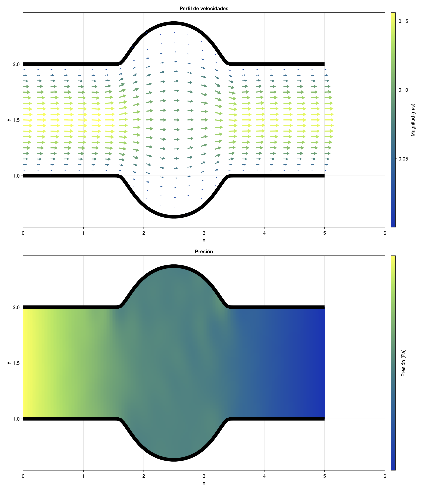
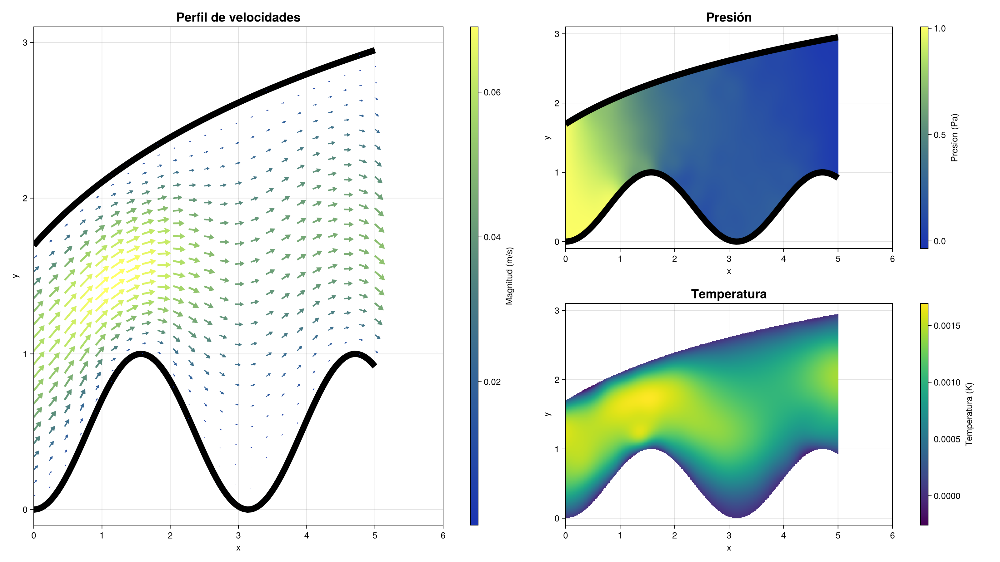

# Simulación de Flujo en Tubos con RBF

Este proyecto implementa un solucionador numérico para problemas de flujo en tubos usando funciones de base radial (RBF) en Julia. El código permite simular perfiles de velocidad, presión y temperatura para un fluido incompresible en geometrías arbitrarias, utilizando métodos de frontera y puntos interiores generados aleatoriamente o siguiendo la geometria del problema.

## Estructura del proyecto

- `Main.jl`: Script principal de simulación y visualización.
- `Backend/`: Módulos con la lógica principal:
  - `Backend.jl`: Orquestador de la simulación.
  - `DataStructures.jl`: Definición de estructuras de datos.
  - `Puntos.jl`: Generación de puntos de frontera e interior.
  - `Matrices.jl`: Construcción de matrices del sistema.
  - `Solucionador.jl`: Solución de sistemas no lineales.
  - `Graficas.jl`: Visualización de resultados.

## Instalación

1. Instala Julia (https://julialang.org/downloads/).
2. Clona este repositorio y entra al directorio del proyecto.
3. Instala los paquetes requeridos en el REPL de Julia:

```julia
using Pkg
Pkg.add(["Random", "Plots", "Distributions", "NonlinearSolve", "SparseArrays", "DelimitedFiles", "LinearAlgebra", "CairoMakie", "ForwardDiff"])
```

4. Instala el paquete RadialBasisFunctions.jl desde GitHub:

```julia
Pkg.add(url="https://github.com/Expleus/RadialBasisFunctions.jl.git")
```

## Uso

Ejecuta el archivo `Main.jl` para correr una simulación de ejemplo:

```julia
include("Main.jl")
```

Puedes modificar los parámetros físicos, geométricos y de simulación en `Main.jl` para adaptar el problema a tus necesidades.

## Visualización

El proyecto genera gráficos de perfiles de velocidad, presión y temperatura, guardados como archivos PNG en el directorio principal.

## Ejemplo de simulación

La siguiente figura muestra un perfil de velocidad simulado en un tubo usando el solver implementado con velocidad y presion desconocida:



La siguiente figura muestra un perfil de velocidad simulado en un tubo usando el solver implementado con velocidad, presion y temperatura desconocida:



## Créditos

Desarrollado por el semillero de fenomenos de transporte EIA-FTA.

## Licencia

Este proyecto se distribuye bajo la licencia CC BY-NC 4.0.